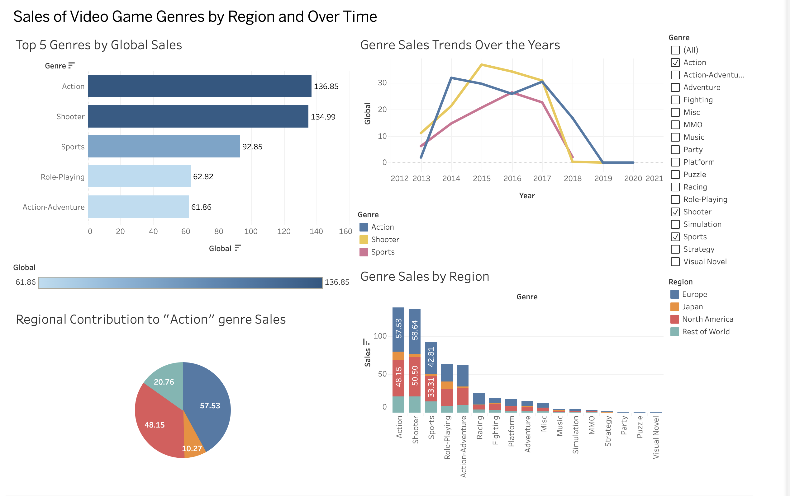

# 🎮 Video Game Genre Sales 

This project analyzes global video game sales by genre, region, and year.  
I used Python to clean the data and prepare visualizations in Tableau Public.

---

## 📌 Project Overview

- **Goal:** Identify the most popular video game genres globally and by region, and understand how their popularity has changed over time.
- **Data Source:** [Kaggle - PS4 Game Sales Dataset](https://www.kaggle.com/datasets/sidtwr/videogames-sales-dataset)
- **Tools Used:**  
  - 🐍 Python (pandas, Jupyter Notebook)  
  - 📊 Tableau Public  
  - 🗂 GitHub

---

## 🧹 Data Cleaning & Preparation

All data cleaning was done in a Jupyter Notebook using pandas.  
Missing values were handled, and I created multiple summary tables used in Tableau:

- `top5_genres_global.csv`: Top 5 genres by global sales  
- `genres_by_region.csv`: Genre sales per region  
- `genre_region_share.csv`: Regional share of one genre  
- `genre_trend.csv`: Genre sales by year

These files are available in the `/data` folder.

---

## 📈 Interactive Dashboard

📊 **Explore the full dashboard here:**  
🔗 [View on Tableau Public](https://public.tableau.com/app/profile/irena.karapetyan/viz/SalesofVideoGamegenres/Dashboard1?publish=yes)

### 👇 Dashboard Preview  
*(Click the image to enlarge)*

